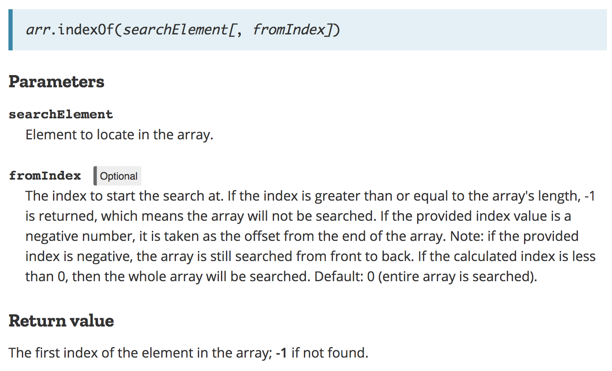
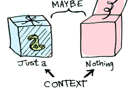
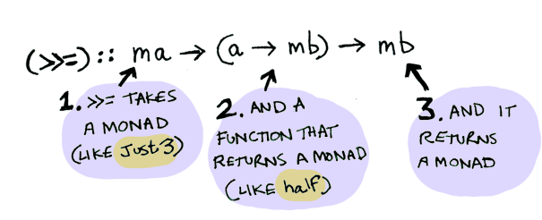

class: center, middle

# What problem a Monad is solving?
.octo-logo[]
---
class: left, top
layout: true
## Definitions

---

---

### Mathematic

A monad is an endofunctor (a functor mapping a category to itself), together with two natural transformations. Monads are used in the theory of pairs of adjoint functors, and they generalize closure operators on partially ordered sets to arbitrary categories.

.right[
<https://en.wikipedia.org/wiki/Monad_(category_theory)>
]

---

### Philosophy

Monad (from Greek μονάς monas, "unit" in turn from μόνος monos, "alone"), refers in cosmogony (creation theories) to the first being, divinity, or the totality of all beings.

.right[
<https://en.wikipedia.org/wiki/Monad_(philosophy)>
]
---

### Functional programming
A monad is a design pattern that defines how functions, actions, inputs, and outputs can be used together to build generic types, with the following organization:

1. Define a data type, and how values of that data type are combined.
2. Create functions that use the data type, and compose them together into actions, following the rules defined in the first step.

.right[
<https://en.wikipedia.org/wiki/Monad_(functional_programming)>
]

--

> This article needs attention from an expert in functional programming. The specific problem is: article fails to succinctly explain the topic and excessively relies on references to Haskell-specific terminology, ideas and examples.

---
layout: false
class: center, middle


???
I will only troll about stuff I know. This is mean for entertainment, don't take it personally.

---
layout: true

## Theory

---

---
class: middle
### What is functional programming?

* Writing code without side effect
  * Easier to test
  * Easier to compose
  * Easier to debug
* Pure functions

---
### Pure functions

> Every calls to a pure function with the same arguments will return the same result

--

```javascript
GetInput(Source) // not pure

today() // not pure

function add4(value) { //pure
  return value + 4;
}
```

--

**We can replace the function and its arguments by its results**

---
### Referencial transparency

> An expression is said to be referentially transparent if it can **be replaced** with its corresponding value **without changing the program's behavior**.

.right[
<https://en.wikipedia.org/wiki/Referential_transparency>
]

--

```c
int globalValue = 0;

int rq(int x) {
  globalValue++;
  return x + globalValue;
}

int rt(int x) {
  return x + 1;
}
```

--

`rt` is referentially transparent: `rt(x) = rt(y)` if `y = x`

---
### Referencial transparency

```c
int globalValue = 0;
int rq(int x) {
  globalValue++;
  return x + globalValue;
}

```
--

```c
int p = rq(x) + rq(y) * (rq(x) - rq(x));
int p = rq(x) + rq(y) * (0);
int p = rq(x) + 0;
int p = rq(x);
```

--

```c
int a = globalValue; int p = x + a + 1 + (y + a + 2) * (x + a + 3 - (x + a + 4)); globalValue = globalValue + 4;
int a = globalValue; int p = x + a + 1 + (y + a + 2) * (x + a + 3 - x - a - 4)); globalValue = globalValue + 4;
int a = globalValue; int p = x + a + 1 + (y + a + 2) * -1; globalValue = globalValue + 4;
int a = globalValue; int p = x + a + 1 - y - a - 2; globalValue = globalValue + 4;
int p = x - y - 1; globalValue = globalValue + 4;
```

---
### What is **not** functional programming?

* A buzz word
* Playing around with high order function
* Adding the latest library to write functional code


---
class: center, middle, conclusion

## Functional Programing .strike[helps] forces the developer to write pure functions

---
layout: true

## Error & state handling

---

--

### Using return code

```c
#include <unistd.h>
#include <stdlib.h>

int read10ByteFromFile(int fd, char *buffer) {
  int len = 10;
  buffer = malloc(len);
  ssize_t nb_bytes_read = read(fd, buffer, 10);
  return (nb_bytes_read >= 0) ? 1 : 0;
}
```

--
.center[
Pros         | Cons
------------ | -------------
Explicit     | Introduce side effect
Easy         |
]


---

### Using specific value

```javascript
const array = [2, 9, 8];
array.indexOf(9);     //  1
array.indexOf(7);     // -1
```

--
.center[
.img-mdn-index-of[
  
]
]

--

.center[
Pros         | Cons
------------ | -------------
Easy         | Implicit
             | Limits future evolution
]


---

### Using Null


```java
public class Main {
  void main(String[] args) {
    int[] myIntArray = new int[]{1,2,3};
    Integer last1 = getLastItemFromCollection(myIntArray);

    int[] myEmptyArray = new int[0];
    Integer last2 = getLastItemFromCollection(myIntArray);
  }

  private Integer getLastItemFromCollection(Integer[] list) {
    if(list.length == 0) {
      return null;
    }
    return list[list.length - 1];
  }
}
```

---
### Using Null


```java
public class Main {
  int main(String[] args) {
    User user = UserService.getUserById(args[0]);
    if(user == null) return 1;
    User[] friends = UserService.getFriends(user);
    if(friends == null) return 2;
    Connections connections = UserService.connect(user, friends);
    MoneyService.sellAddToGetDollars(connections);
    return 1;
  }
}
```

--

```
Exception in thread "main" java.lang.NullPointerException
        at java.lang.System.arraycopy(Native Method)
        at test.main(test.java:10)
```

--

.center[
Pros         | Cons
------------ | -------------
Easy         | Implicit
             | Verbose
             | Error prone
]

???

* runtime error vs compile time error

---

### Using Null


> I call it my billion-dollar mistake… At that time, I was designing the first comprehensive type system for references in an object-oriented language. My goal was to ensure that all use of references should be absolutely safe, with checking performed automatically by the compiler. But **I couldn’t resist the temptation to put in a null reference, simply because it was so .color-red[easy] to implement.** This has led to innumerable errors, vulnerabilities, and system crashes, which have probably **caused a billion dollars of pain and damage in the last forty years**.

.right[Tony Hoare, inventor of ALGOL W.]


---

### Using Exceptions


```scala
def mean(myList: List[Double]): Double = {
  if(myList.isEmpty) {
    throw new ArithmeticException("Impossible to get mean of empty list")
  }
  return myList.sum / myList.size
}
```

--

.center[
Pros         | Cons
------------ | -------------
Easy         | Implicit
             | *Not pure*
             | Verbose
]

---

### Using Exceptions

```java
try {
  User user = UserService.getUserById(userId);
  User[] friends;
  try {
    friends = UserService.getFriends(user);
  } catch(Exception ex) {
    friends = handleLonelyPerson(ex);
  }
  Connections connections = UserService.connect(user, friends);
} catch(OtherException ex) {
  dealWithIt(ex);
} catch(Exception ex) {
  dealWithItButDifferently(ex);
}
```
--

.center[
Pros         | Cons
------------ | -------------
Easy         | Implicit
             | Verbose
]

---

### Using Exceptions (purity)
```scala
def failingFn(i: Int): Int = {
  val y: Int = throw new Exception("fail!")
  try {
    val x = 42 + 5
    x + y
  }catch { case e: Exception => 43 }
}
```

--

```
scala> failingFn(12)
java.lang.Exception: fail!
  at .failingFn(<console>:8)
  ...
```

---
### Using exception (purity)

```scala
def failingFn2(i: Int): Int = {
  try {
    val x = 42 + 5
    x + ((throw new Exception("fail!")): Int)
  } catch { case e: Exception => 43 }
}
```
--

```
scala> failingFn2(12)
res1: Int = 43
```
--

.center[
Pros         | Cons
------------ | -------------
Easy         | Implicit
             | Verbose
             | *Not pure*
]

---

### Using checked Exceptions

```java
class MyClass {
  public void myMethod1() throws Exception1 {
    myMethod2();
  }
  public void myMethod2() throws Exception1 {
    myMethod3();
  }
  public void myMethod3() throws Exception1 {
    myMethod4();
  }
  public void myMethod4() throws Exception1 {
    throw new Exception1("Oups");
  }
}
```

```scala
def map[A,B](l: List[A])(f: A => B): List[B]
```
--

.center[
Pros         | Cons
------------ | -------------
Easy         | Verbose
*Explicit*   | *Violate Open-Close Principle*
]

???

open for extension, but closed for modification

---

### Using checked Exceptions


```scala
def map[A,B](l: List[A])(f: A => B): List[B]
```
--

.center[
Pros         | Cons
------------ | -------------
Easy         | Verbose
Explicit     | Violate Open-Close Principle
             | *High order function*
]

---

layout: true
class: middle

## What else then ?

---

### Requirements

* **Handle state and error**
* Easy
* Explicit
* Work well with lambda
* Not too verbose

---

layout: true
class: left, top

## Let's create our monad

---

### Value and operation

```scala
case class User(String: email, Int: age) // value

User user = UserService.getUserById(userId) // operations
```

--
.center[

]
.legend[
<http://adit.io/posts/2013-04-17-functors,_applicatives,_and_monads_in_pictures.html>
]
---

### Context

.center[

]

.legend[
<http://adit.io/posts/2013-04-17-functors,_applicatives,_and_monads_in_pictures.html>
]


---

### Create our data structure

.center[

]

.legend[
<http://adit.io/posts/2013-04-17-functors,_applicatives,_and_monads_in_pictures.html>
]

--

```Haskell
data Maybe a = Nothing | Just a
```

---
### Create our data structure


```Scala
trait Option[+A]

case class Some[+A](get: A) extends Option[A]
case object None extends Option[Nothing]
```

---
### Create our data structure


```Scala
trait Option[+A] {
  def isPresent: Boolean
}
case class Some[+A](get: A) extends Option[A] {
  def isPresent = true
}
case object None extends Option[Nothing] {
  def isPresent = false
}
```

---

### Using new container

```scala
def main(String[] args): Int {
  Option[User] user = UserService.getUserById(args[0]);
  if(!user.isPresent) return 1;
  Option[Friends] friends = UserService.getFriends(user.get);
  if(!friends.isPresent) return 1;
  Option[Connections] connections = UserService.connect(user.get, friends.get);
  if(!connections.isPresent) return 1;
  MoneyService.sellAddToGetDollars(connections.get);
  return 1;
}
```

--

.center[
Pros              | Cons
----------------- | -------------
Explicit          | Verbose
Work with lambda  |
]


???

Exist in Java 5. Did not worked:
 * path of least resistance
 * no API implemented it
---

### Functor

.center[

]

.legend[
<http://adit.io/posts/2013-04-17-functors,_applicatives,_and_monads_in_pictures.html>
]

---

### Functor

.center[

]

.legend[
<http://adit.io/posts/2013-04-17-functors,_applicatives,_and_monads_in_pictures.html>
]

--

```haskell
fmap (+3) (Just 2)
```

--

```haskell
Just 5
```

---

### Functor


.center[

]

.legend[
<http://adit.io/posts/2013-04-17-functors,_applicatives,_and_monads_in_pictures.html>
]


---

### Functor

```haskell
fmap (+3) Nothing
```

--

.center[

]

.legend[
<http://adit.io/posts/2013-04-17-functors,_applicatives,_and_monads_in_pictures.html>
]

--

```haskell
Nothing
```

---

### Functor

```Scala
trait Option[+A] {
  def map[B](f: A => B): Option[B]
}
case class Some[+A](get: A) extends Option[A] {
  def map[B](f: A => B): Option[B] = Some(f(this.get))
}
case object None extends Option[Nothing] {
  def map[B](f: A => B): Option[B] = None
}
```

---

### Functor


```scala
def main(String[] args): Int {
  Option[User] user = UserService.getUserById(args[0]);
  Option[String] email = user.map(user => user.email)
  Option[Option[Friends]] friends = user.map(user => UserService.getFriends(user))
  return 1;
}
```

--

.center[
Pros              | Cons
----------------- | -------------
Explicit          | Verbose
Work with lambda  |
]

---

.center[

]

--

.center[

]


---
### Monad


.center[

]

.legend[
<http://adit.io/posts/2013-04-17-functors,_applicatives,_and_monads_in_pictures.html>
]

---

### Monad

```Scala
trait Option[+A] {
  def map[B](f: A => B): Option[B]
  def flatMap[B](f: A => Option[B]): Option[B]
}
case class Some[+A](get: A) extends Option[A] {
  def map[B](f: A => B): Option[B] = Some(f(this.get))
  def flatMap[B](f: A => Option[B]): Option[B] = f(this.get)
}
case object None extends Option[Nothing] {
  def map[B](f: A => B): Option[B] = None
  def flatMap[B](f: A => Option[B]): Option[B] = None
}
```

---

### Monad

```Scala
trait Option[+A] {
  def map[B](f: A => B): Option[B]
  def flatMap[B](f: A => Option[B]): Option[B]
}
case class Some[+A](get: A) extends Option[A] {
  def map[B](f: A => B): Option[B] = Some(f(this.get))
  def flatMap[B](f: A => Option[B]): Option[B] = f(this.get)
}
case object None extends Option[Nothing] {
  def map[B](f: A => B): Option[B] = None
  def flatMap[B](f: A => Option[B]): Option[B] = None
}
```

---

### Monad


```scala
def main(String[] args): Int {
  Option[User] user = UserService.getUserById(args[0]);
  Option[Friends] friends = user.flatMap(u =>  UserService.getFriends(u)
  Option[Connections] connections = friends.flatMap(f => UserService.connect(f))
  Option[Dollars] dollars =  connections.flatMap(c => MoneyService.sellAddToGetDollars(c))
  return 1;
}
```


---
### Monad


```scala
def main(String[] args): Int {
  Option[Dollars] dollars = UserService.getUserById(args[0])
        .flatMap(UserService.getFriends)
        .flatMap(UserService.connect)
        .flatMap(UserService.sellAddToGetDollars)
  return 1;
}
```

--

.center[
Pros              | Cons
----------------- | -------------
Explicit          |
Work with lambda  |
]

---
layout: true

## Limitations

---

---
* Implemented in native function
* Implemented in common library

---
### Common Monad

 * one you used the third you started coding
 * one in Javascript
